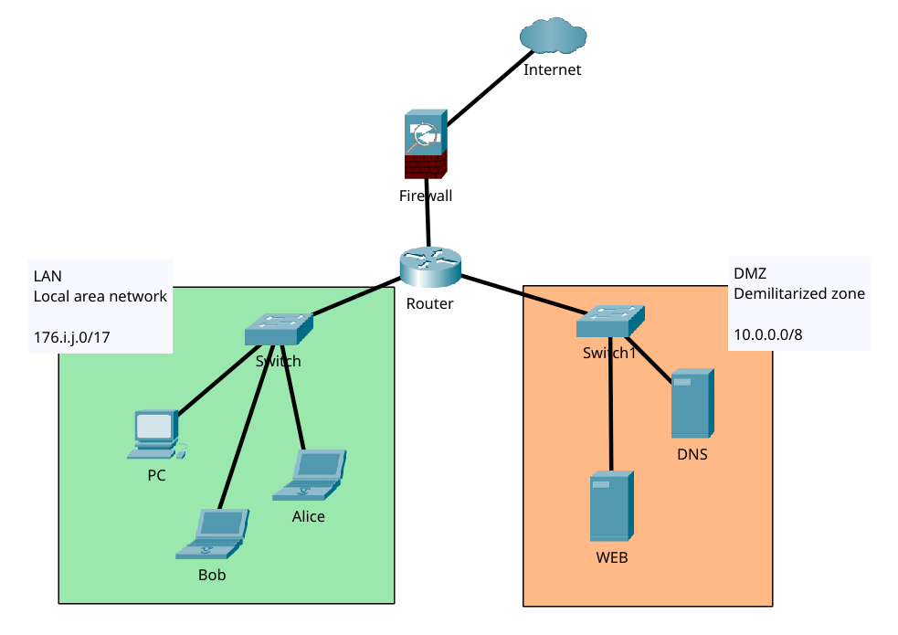

# Configuration réseau

Nous allons utiliser les plages suivantes : `172.16.0.0/17` à `172.31.128.0/17` (soient 32 plages disponibles). 

Dans la suite, nous attribuons 2 valeurs aux étudiants : _i_ et _j_

- _16 ≤ i ≤ 31_
- _j = 0_ ou _j = 128_ 


## Organisation du réseau

Le réseau aura la topologie suivante : 



- l'accès Internet passe par un _firewall_;
- un routeur permet de séparer la zone _LAN_ de la zone _DMZ_;
- le LAN a une plage d'adresse spécifique dans `176.i.0.0/17`
- la DMZ a également sa plage d'adresses

**Plan d'adressage**

| Zone | Réseau | 
|------|--------|
| **LAN** | `172.i.j.0/17` |
| **DMZ** | `10.k.0.0/16` |
| **Routeur**  Interface privée | `172.i.j.1/17` |
| **Routeur**  Interface DMZ | `10.k.0.1/16` |

Le routeur possède deux interfaces réseau, une dans chaque zone, et assure le routage et le filtrage entre le réseau privé et la DMZ.

## Routage statique

Une machine linux peut agir comme un routeur. Pour ce faire : 

1. activer l'_IP forwarding_

    Par défaut chaque interface réseau reste dans son segment et les paquets (_paquets_) ne passent pas d'une interface à l'autre. 

    ```bash
    echo 1 > /proc/sys/net/ipv4/ip_forward
    ```
    Pour rendre permanent, éditer `/etc/sysctl.conf` :
    ```
    net.ipv4.ip_forward=1
    ```

2. configurer chaque interface dans son réseau. Soit « directement » à coups de `ip address` soit en éditant `/etc/network/interfaces` :
    
    ```
    auto eth0
    iface eth0 inet static
         address 172.i.j.1
         netmask 255.255.128.0

    auto eth1
    iface eth1 inet static
         address 10.k.0.1
         netmask 255.255.0.0
    ```

    :::warning
    Bien sûr, il faut d'abord trouver le nom de ses interfaces. 
    :::

3. ajouter les routes statiques. Soit directement, à cous de `ip route`, 

    ```bash
    ip route add 10.k.0.0/16 via 10.k.0.1 dev eth1
    ip route add 172.i.j.0/17 via 172.i.j.1 dev eth0
    ```

    soit en éditant `/etc/network/interfaces` :

    ```
    auto eth0
    iface eth0 inet static
         address 172.i.j.1
         netmask 255.255.128.0
         up ip route add 172.i.j.0/17 dev eth0

    auto eth1
    iface eth1 inet static
         address 10.k.0.1
         netmask 255.255.0.0
         up ip route add 10.k.0.0/16 dev eth1
    ```


4. redémarrer le service réseau :

    ```bash
    systemctl restart networking
    ```

## Configuration du firewall

### Principes des règles de filtrage avec UFW

**UFW** (_Uncomplicated Firewall_) est une interface simplifiée pour iptables. Les règles sont évaluées dans l'ordre et la première règle correspondante est appliquée.

Principes de base :

- par défaut, le trafic entrant est bloqué tandis que le trafic sortant est autorisé;
- des règles spécifiques sont ensuite ajoutées en fonctions des flux à autoriser ;
- les règles sont traitées de la plus spécifique à la plus générale

Syntaxe de base UFW

Vérifier le statut
    
```bash
ufw status
ufw status verbose
ufw status numbered
```

Activer/Désactiver UFW

```bash
ufw enable
ufw disable
```

Règles de base

```bash
# Autoriser un port
ufw allow 22
ufw allow 80/tcp
ufw allow 443/tcp

# Bloquer un port
ufw deny 23
ufw deny 3306/tcp

# Autoriser depuis une adresse IP
ufw allow from 192.168.1.100

# Bloquer depuis une adresse IP
ufw deny from 192.168.1.50

# Autoriser un réseau vers un port spécifique
ufw allow from 172.16.0.0/16 to any port 22

# Bloquer un réseau
ufw deny from 10.0.0.0/8
```

Supprimer une règle

```bash
# Par numéro (utiliser ufw status numbered pour voir les numéros)
ufw delete 3
# Par description
ufw delete allow 80/tcp
```

### Configuration du firewall entre LAN et DMZ

1. Activer UFW et définir les règles par défaut

    ```bash
    ufw default deny incoming
    ufw default allow outgoing
    ufw enable
    ```

2. Autoriser le LAN à accéder à la DMZ
    
    ```bash
    # Autoriser tout le trafic du LAN vers la DMZ
    ufw allow from 172.i.j.0/17 to 10.k.0.0/16
    
    # Ou de manière plus restrictive, autoriser uniquement certains services
    ufw allow from 172.i.j.0/17 to 10.k.0.0/16 proto tcp port 80
    ufw allow from 172.i.j.0/17 to 10.k.0.0/16 proto tcp port 443
    ```

3. Bloquer l'accès de la DMZ vers le LAN

    ```bash
    ufw deny from 10.k.0.0/16 to 172.i.j.0/17
    ```

4. Autoriser Internet à accéder aux services de la DMZ (à adapter en fonction des services)

    Par exemple :
    ```bash
    ufw allow in on eth2 to 10.k.0.0/16 proto tcp port 80
    ufw allow in on eth2 to 10.k.0.0/16 proto tcp port 443
    ```

Voici les commandes équivalentes avec iptables :

```bash
# Politique par défaut
iptables -P INPUT DROP
iptables -P FORWARD DROP
iptables -P OUTPUT ACCEPT
# Autoriser le LAN vers la DMZ
iptables -A FORWARD -s 172.i.j.0/17 -d 10.k.0.0/16 -j ACCEPT
iptables -A FORWARD -m state --state ESTABLISHED,RELATED -j ACCEPT
# Bloquer la DMZ vers le LAN
iptables -A FORWARD -s 10.k.0.0/16 -d 172.i.j.0/17 -j DROP
# Autoriser Internet vers les services DMZ (HTTP/HTTPS)
iptables -A FORWARD -i eth2 -d 10.k.0.0/16 -p tcp --dport 80 -j ACCEPT
iptables -A FORWARD -i eth2 -d 10.k.0.0/16 -p tcp --dport 443 -j ACCEPT
# Sauvegarder les règles
iptables-save > /etc/iptables/rules.v4
```

:::warning
Vérifiez bien les noms de vos interfaces réseau avant d'appliquer ces règles.
:::