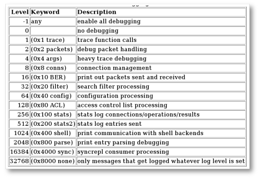
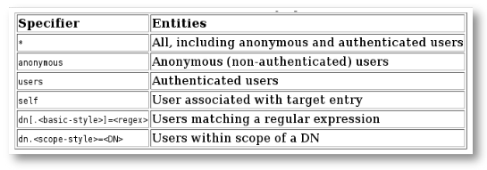
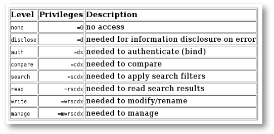

# Laboratoire LDAP

Mise en œuvre des concepts d'annuaire LDAP via OpenLDAP (http://openldap.org).

:::tip Remerciements
Je profite de ce résumé pour remercier Gérarld Carter, auteur de *LDAP Administration System*, dont les éclaircissements m'ont beaucoup apporté. Les étudiants de la promotion 2004-2005 ont aussi apporté leur pierre à l'édifice en donnant les exemples de manipulation pour les API Perl et PHP. Qu'ils en soient ici remerciés.
:::

:::warning Remarque importante
Ces notes concernent la version 2.4 d'OpenLDAP. Cette version apporte un grand changement en terme de configuration. En effet la configuration d'OpenLDAP 2.3 se concentrait dans le fichier `/etc/ldap/slapd.conf` tandis que la configuration d'OpenLDAP 2.4 se trouve dans le répertoire `/etc/ldap/slapd.d`, répertoire qu'il est déconseillé de manipuler brutalement. Cette nouvelle approche permettra notamment de modifier le serveur au *runtime*.

> Although the slapd-config(5) system stores its configuration as (text-based) LDIF files, you should never edit any of the LDIF files directly. Configuration changes should be performed via LDAP operations, e.g. ldapadd(1), ldapdelete(1), or ldapmodify(1).  
> — Extrait de http://www.openldap.org/doc/admin24/slapdconf2.html
:::

## Lectures

- OpenLDAP Administrator's guide : http://openldap.org/doc/admin24
- La page de manuel `slapd-config(5)`
- Le fichier `README.Debian` fourni avec le paquet (`/usr/share/doc/slapd/README.Debian`)
- *LDAP Administration Système*, ed. O'REILLY, Gerald CARTER, ISBN 2 84177 293 4
- IANA-registered private enterprise : http://www.alvestrand.no/objectid
- Un article sur le blog locallost : http://locallost.net/?p=215

## Préalables

### Installation de OpenLDAP

Installation des paquets de la distribution. Sous Debian, installez les paquets `slapd`, `ldap-utils` et `openssl`.

Lors de l'installation, rien ne vous est demandé car `apt` prend l'initiative de créer un rootDSE basé sur votre hostname. Comme cela ne vous plaît pas, n'hésitez pas à reconfigurer votre paquet par le biais de la commande suivante en choisissant comme nom de domaine `esigoto.info` :

```bash
dpkg-reconfigure slapd
```

:::info
Un nom d'organisation vous sera demandé. En choisissant `esigoto.info`, cela implique que le rootDSE de l'annuaire sera `dc=esigoto, dc=info`.
:::

Un répertoire `/etc/ldap/slapd.d` est créé contenant un sous-répertoire `cn=config` et un fichier `cn=config.ldif`. La configuration de OpenLDAP est sauvegardée dans un annuaire LDAP spécifique.

  
_Source [openldap.org/doc/admin26](https://openldap.org/doc/admin26/)_

Dans le répertoire `/etc/ldap/` se trouvent :

- un répertoire `schema` contenant les différents schémas utilisables
- un répertoire `slapd.d` contenant la configuration du serveur LDAP (ne rien modifier dans ce répertoire)
- un répertoire `sasl2` (pour plus tard)

Pour avoir un aperçu de la configuration, `ldapsearch` fait l'affaire, entrez la commande suivante en root :

```bash
ldapsearch -LLL -Y EXTERNAL -H ldapi:/// -b "cn=config"
```

Pour avoir un aperçu du contenu de l'annuaire, `ldapsearch` fait également l'affaire. Ce n'est plus le nœud `cn=config` qui vous intéresse mais le nœud `dc=esigoto, dc=info`. Entrez une des deux commandes suivantes (la première en root, la seconde en tant que user normal ou root) :

```bash
ldapsearch -LLL -Y EXTERNAL -H ldapi:/// -b "dc=esigoto,dc=info"
ldapsearch -LLL -D "cn=admin,dc=esigoto,dc=info" 
    -b "dc=esigoto,dc=info" -x -W
```

Le mot de passe à entrer dans la deuxième commande est bien sûr le mot de passe que vous avez choisi lors de la configuration de l'annuaire…

:::warning Remarques
- Il n'y a plus de fichier `slapd.conf` depuis la version 2.4. Il peut y avoir un fichier `ldap.conf` utile aux clients LDAP tels que `ldapadd`, etc.
- Le serveur est démarré et toute la configuration se fera « à chaud »

```bash
service slapd start # ou
systemctl start slapd
```
:::

### À propos des schémas

Pour configurer un serveur LDAP, il faut mettre en place des schémas. Certains existent et sont fournis avec l'implémentation, d'autres peuvent être écrits. Dans une première approche, nous utiliserons les schémas existants. Notre manipulation portera sur le schéma `inetOrgPerson`.

Pour le voir :

```bash
vim /etc/ldap/schema/inetorgperson.schema
```

L'entrée `cn=schema,cn=config` contient les schémas systèmes. Pour voir les schémas déjà connus par l'annuaire :

```bash
ldapsearch -LLL -Y EXTERNAL -H ldapi:/// -b "cn=schema,cn=config"
```

Activer un schéma se fera par le biais de la commande :

```bash
ldapadd -Y EXTERNAL -H ldapi:/// -f /etc/ldap/schema/inetorgperson.ldif
```

:::info
Si vous essayez d'ajouter le schéma `inetorgperson` par le biais de la commande précédente, vous obtenez une erreur… le schéma est déjà connu.
:::

### À propos des logs

Il est toujours bon d'avoir des logs (surtout en phase de test) de fonctionnement d'un serveur. Nous pouvons préciser au serveur la « quantité » d'informations que nous désirons. Pour ce faire on positionne le paramètre `olcLogLevel` (anciennement `loglevel`). Les différentes valeurs peuvent être vues comme une série de choix que nous pouvons additionner. 

Nous choisissons, par exemple, 296, soit 8+32+256 : gestion des connexions, traitement des filtres de recherche et statistiques sur les connexions. Plutôt qu'une valeur numérique, il est possible de choisir une suite de keywords, par exemple : `conns`, `filter`, `stats`, etc.

  _Source [openldap.org/doc/admin26](https://openldap.org/doc/admin26/)_

Le niveau de « verbosité » des logs se définit via la directive `olcLogLevel` du schéma `cn=config`. Avant tout, regardez quelle valeur a ce paramètre. Vous pouvez le voir en faisant une recherche dans la config :

```bash
ldapsearch -LLL -Y EXTERNAL -H ldapi:/// -b "cn=config" "(olcLogLevel=*)"
```

Ensuite modifiez-le. Cette modification devra se faire à l'aide d'un fichier LDIF. Un fichier LDIF (`config.ldif`) pourrait avoir la forme :

```ldif
dn: cn=config
changetype: modify
add: olcLogLevel
olcLogLevel: Stats Config
```

Et être soumis via une commande de la forme :

```bash
ldapadd -Y EXTERNAL -H ldapi:/// -f config.ldif
```


### À propos des ACL

Les ACL (Access Control List) OpenLDAP permettent de préciser qui a accès à quoi dans l'annuaire. Le *qui* peut être choisi parmi `*`, `self`, `anonymous`, `user` ou `regexp`.

  
_Source [openldap.org/doc/admin26](https://openldap.org/doc/admin26/)_

Les niveaux d'accès sont, quant à eux, choisis parmi : `none`, `disclose`, `auth`, `compare`, `search`, `read`, `write` et doivent être choisis dans l'ordre. Donner comme niveau d'accès `write` implique de donner les accès : `read`, `search`, `compare`, `auth`, `disclose` et `none`.

  
_Source [openldap.org/doc/admin26](https://openldap.org/doc/admin26/)_

Chaque niveau d'accès a une certaine portée (*scope*) qui peut être : `base`, `one`, `subtree` ou `children`.

Le *quoi* détermine les entrées concernées par l'ACL. Il est composé de trois parties :
- une expression régulière déterminant le DN
- un filtre de recherche
- une liste de noms d'attributs séparés par des virgules

Les ACL peuvent être définies de manière dynamique, par le biais de fichier LDIF. C'est l'attribut `olcAccess` qui définit cet accès.


#### Exemples

Un exemple simple donnant l'accès à tous en lecture :

```ldif
olcAccess: to * by * read
```

Une directive donnant la possibilité à l'utilisateur de la modifier, aux anonymes de s'authentifier, et aux autres de lire l'entrée :

```ldif
olcAccess: to *
    by self write
    by anonymous auth
    by * read
```

Les entrées sous le sous-arbre `dc=com` sont accessibles en écriture, excepté pour les entrées sous `dc=example,dc=com` pour lesquelles un accès en lecture est autorisé :

```ldif
olcAccess: to dn.children="dc=com"
    by * write
olcAccess: to dn.children="dc=example,dc=com"
    by * read
```

:::warning Remarque
L'ordre dans lequel sont placées ces directives a de l'importance. Puisque cet ordre a de l'importance, la partie « quoi » est affublée automatiquement lors de l'ajout dans l'annuaire d'un numéro d'ordre placé entre accolades `{i}`.

Si l'on crée les entrées :

```ldif
olcAccess: to attrs=member,entry
    by dnattr=member selfwrite
olcAccess: to dn.children="dc=example,dc=com"
    by * search
olcAccess: to dn.children="dc=com"
    by * read
```

Ce sont ces entrées qui sont enregistrées :

```ldif
olcAccess: {0}to attrs=member,entry
    by dnattr=member selfwrite
olcAccess: {1}to dn.children="dc=example,dc=com"
    by * search
olcAccess: {2}to dn.children="dc=com"
    by * read
```
:::

### Fichiers LDIF et données de l'annuaire

Les fichiers au format LDIF permettent la communication entre l'annuaire LDAP et ses clients. Ce sont eux qui permettront, entre autres, l'ajout, la suppression, la modification des nœuds de l'arbre.

:::warning Remarque préalable
Les espaces et les passages de ligne ont une certaine importance :
- chaque ligne est terminée par un *line feed* (`<LF>`) ou *carriage return* suivi de *line feed* (`<CR><LF>`)
- une ligne commençant par un *hash* (`#`) est un commentaire
- une ligne commençant par un espace (`SPACE`) continue la ligne qui précède
- une ligne vide permet de séparer deux entrées différentes tandis que
- une ligne commençant par un tiret (*dash* `-`) permet de terminer une opération et permettre d'en commencer une nouvelle (sur la même entrée)
:::

L'allure générale d'un fichier LDIF est la suivante :

```ldif
dn: distinguished_name
changetype: add|delete|modify|modrdn|moddn
attribute_type: attribute_value
...
objectClass: object_class_value
...
```

- `dn` est le *distinguished name*. Par exemple :
  ```
  dn: cn=Quintine, ou=Brasserie des géants, dc=esigoto, dc=info
  ```

- `changetype` précise ce que l'on veut faire sur le nœud en question (s'il est omis ce sera `add` pour la commande `ldapadd`, `delete` pour la commande `ldapdelete`). Dans tous les autres cas (via la commande `ldapmodify`), le type de modification (`add`, `replace`, `delete`, ...) devra être précisé.

- `attribute_type` précise une (ou plusieurs) paire(s) « nom d'attribut / valeur ». Si la classe impose des attributs, ils devront être renseignés ; certains attributs sont obligatoires, d'autres facultatifs (voir le fichier de définition de schéma correspondant). Par exemple :
  ```
  cn=Quintine
  olcLogLevel= Stats
  ```

- `objectClass` est une directive précisant à quel(s) type(s) de classe l'entrée appartient... il peut y en avoir plusieurs. Par exemple :
  ```
  objectClass: inetPerson
  objectClass: organizationalPerson
  objectClass: studentPerson
  ```

#### Ajouter une entrée

Pour ajouter une entrée, le fichier LDIF (ou du moins la partie concernant cette entrée) pourra avoir la forme suivante :

```ldif
dn: cn=Suzie Smith,ou=Server Technology,o=Acme, c=US
changetype: add
cn: Suzie Smith
cn: SuzieS
sn: Smith
mail: ssmith@us.Acme.com
telephoneNumber: 69332
photo: $ORACLE_HOME/empdir/photog/ssmith.jpg
objectClass: organizationalPerson
objectClass: person
objectClass: top
```

#### Supprimer une entrée

Pour supprimer une entrée, le fichier LDIF pourra avoir la forme suivante :

```ldif
dn: cn=Suzie Smith,ou=Server Technology,o=Acme, c=US
changetype: delete
```

#### Modifier une entrée

Lorsque l'on choisit comme `changetype` la valeur `modify`, on peut alors choisir si l'attribut sera : ajouté, supprimé ou modifié.

- **add** – ajoute un attribut (si cet attribut existe déjà avec une autre valeur, une nouvelle paire attribut / valeur est ajoutée)

  ```ldif
  add: description
  description: My description
  ```

- **delete** – supprime tous les attributs de ce type sauf si l'on précise lequel on veut supprimer

  ```ldif
  delete: work-phone
  ```

  ou

  ```ldif
  delete: mobileTelephonNumber
  mobiletelephonnumber: +32 (0) 123 45 67 89
  ```

- **replace** – modifie l'attribut concerné. Si l'attribut a plusieurs valeurs, toutes les valeurs sont remplacées (s'il ne faut en remplacer qu'une, faire un `delete` suivi d'un `add`)

  ```ldif
  replace: home-phone
  home-phone: +32 (2) 123 45 67
  ```

#### Exemple complet

```ldif
dn: cn=Pierre Brochant,ou=Sales,o=Oracle,c=US
changetype: modify
add: work-phone
work-phone: 650/506-7000
work-phone: 650/506-7001
-
delete: home-fax
-
replace: home-phone
home-phone: 415/697-8899
```

## Exercice : schéma existant

Afin de mettre en place un serveur LDAP, nous devrions analyser le type d'éléments que devrait contenir notre annuaire et choisir, voire écrire, nos schémas (voir la section suivante). Dans un premier temps, nous allons utiliser un schéma existant, le schéma `inetOrgPerson`. Ce schéma est défini pour stocker des personnes. Il hérite de `person` (défini dans le fichier `core.schema`).

### Annuaire d'étudiants

Nous allons créer un annuaire contenant des *students*. Pour ce faire, il faut ajouter un nœud parent de tous les étudiants. Un fichier LDIF pourra avoir l'allure suivante (l'opération par défaut est l'ajout) :

```ldif
# Création de l'ou student
dn: ou=student,dc=esigoto,dc=info
objectClass: organizationalUnit
ou: student
```

Si le fichier s'appelle `/tmp/racine.ldif`, on l'inclura dans l'annuaire via la commande :

```bash
ldapadd -D "cn=admin,dc=esigoto,dc=info" -W -f /tmp/racine.ldif
```

Les options signifient :
- `-D` : précise qui est le rootdn
- `-W` : prompte pour un password (est semblable à `-w secret`)

Si l'on veut consulter le contenu de l'annuaire, un `ldapsearch` comme celui-ci devrait suffire :

```bash
ldapsearch -LLL -x -b "dc=esi,dc=be" "(objectclass=*)"
```

L'option `-x` indique que nous voulons une authentification simple (à l'inverse d'une authentification SASL dont nous n'avons pas parlé), l'option `-b` précise quel est le suffixe de l'annuaire.

Pour ajouter (ou modifier) des données, nous utilisons l'utilitaire `ldapadd` avec "le fichier LDIF qui va bien". Voici un exemple de fichier LDIF permettant l'ajout d'utilisateurs :

```ldif
# Ajout d'utilisateur
# Entrée Juste LEBLANC
dn: cn=Juste LEBLANC,ou=student,dc=esigoto,dc=info
objectclass: inetOrgPerson
cn: Juste LEBLANC
sn: Juste
mail: juste.leblanc@dev.null
mail: juste@leblanc.name
description: Il s'appelle Juste Leblanc.
 Ah bon, il a pas de prénom.

# Entrée Marlene Sassoeur
dn: cn=Marlene SASSOEUR,ou=student,dc=esigoto,dc=info
objectclass: inetOrgPerson
cn: Marlene SASSOEUR
sn: Marlene
mail: marlene.sassoeur@dev.null
description: Elle me dit c'est Marlene sa soeur.
 Avouez que c'est confusant.
```

Si le fichier s'appelle `/tmp/ajout.ldif`, nous ajouterons les entrées dans l'annuaire via la commande :

```bash
ldapadd -D "cn=admin,dc=esi,dc=be" -W -x -v -f /tmp/ajout.ldif
```

Les options signifient :
- `-D` : précise qui est le rootdn
- `-W` : prompte pour un password (est semblable à `-w secret`)
- `-x` : indique l'authentification simple
- `-f` : renseigne le fichier source, par défaut c'est stdin
- `-v` : verbeux

:::warning Remarque
`slapd` suppose que les fichiers sont encodés en UTF8. Les données sont encodées en UTF8 et codées en Base64 afin d'éviter toute altération des données. Vérifiez bien que votre système est en UTF8 et que votre éditeur écrit bien en UTF8... sinon il faudra convertir vos fichiers à grands coups de `iconv`.
:::

### Recherche dans l'annuaire

La recherche la plus globale est la recherche « montre-moi tout ». Une commande du genre devrait suffire (la seconde commande demande de lister uniquement les attributs `dn` et `sn`) :

```bash
ldapsearch -LLL -x -b "dc=esigoto,dc=info" "(objectclass=*)"
ldapsearch -LLL -x -b "dc=esigoto,dc=info" "(objectclass=*)" dn sn
```

Un filtre LDAP a la forme suivante : `( attribut opérateur valeur )`

L'**attribut** est le nom de l'attribut !

L'**opérateur** est choisi parmi :
- `=` pour l'égalité
- `~=` pour les comparaisons approximatives
- `<=` pour les comparaisons "inférieur ou égal"
- `>=` pour les comparaisons "supérieur ou égal"

La partie **valeur** peut être une valeur absolue (`cn=juste`) ou une valeur reposant sur les wildcards (`cn=*blanc`).

Nous pouvons regrouper des filtres élémentaires en utilisant les opérateurs booléens : `&` (ET), `|` (OU) et `!` (NON). Ces opérateurs utilisent la notation préfixée.

Pour rechercher les enregistrements ayant comme nom « gouyasse » ou « quintine », nous aurons :

```
(|(cn=gouyasse)(cn=quintine))
```

Pour rechercher des enregistrements des brasseries de Silly et d'Ellezelles qui sont des "pils", on aura :

```
(&(|(ou=*Ellezelles*)(ou=*Silly*))(cn=pils))
```

Afin d'éviter d'obtenir trop de résultats lors d'une recherche du genre `(objectclass=*)`, `ldapsearch` permet de définir des limites quant à l'information retournée :

- `-l entier` : définit en secondes, la durée d'attente maximale de la réponse à une demande de recherche
- `-z entier` : définit le nombre d'entrées maximal à récupérer lorsqu'une recherche aboutit

Ces valeurs peuvent être définies dans le fichier `ldap.conf` en utilisant les paramètres `timelimit` et `sizelimit`. Une valeur de 0 en "ligne de commande" annule les limites imposées dans le fichier de configuration des utilitaires LDAP.

## Exercice : schéma modifié

### Rappels

Les schémas proposés par le serveur ne sont pas toujours adaptés. Pour créer un schéma personnel, il faut :

1. Attribuer un OID unique aux nouveaux attributs et aux nouvelles classes
2. Créer le fichier de schéma et « l'inclure » dans la configuration du serveur

Pour rappel, les schémas sont approuvés par l'IANA. Cet organisme attribue un numéro d'entreprise unique à qui en fait la demande (via http://pen.iana.org/pen/PenApplication.page). Le numéro attribué à l'école est **23162** (la liste se trouve là : http://www.iana.org/assignments/enterprise-numbers).

Les OIDs doivent être uniques. Nous allouons l'arc d'OID `1.3.6.1.4.1.23162.504` aux nouvelles classes d'objets en suivant la structure :

```
iso(1)
|- org(3)
|--- dod(6)
|---- internet (1)
|----- private (4)
|------- enterprise (1)
|-------- esi.be (23162)
|--------- local504 (504)
```

Nous ne pouvons pas modifier la structure de l'arbre « au-dessus » de notre numéro d'entreprise mais nous sommes libres de l'organiser comme bon nous semble « en-dessous ». Je me réserve le numéro 504 pour le local et laisse le reste libre pour les autres laboratoires.

Nous utiliserons :
- `23162.504.1` pour les classes d'objets
- `23162.504.2` pour les attributs que nous créerons

Nous décidons de créer un schéma permettant de stocker des informations sur des bières. Nous définirons un DN grâce au nom de la brasserie et à celui de la bière. Pour définir la brasserie nous utiliserons le schéma existant `organizationalUnit` tandis que pour la bière, nous en créerons un pour l'occasion.

### Schéma organizationalUnit

Ce schéma propose les attributs décrits ci-dessous. Il nous permettra de sauvegarder les données relatives à une brasserie. Dans un premier temps, un nom et une description suffiront.

```
objectclass ( 2.5.6.5 NAME 'organizationalUnit'
    DESC 'RFC2256: an organizational unit'
    SUP top STRUCTURAL
    MUST ou
    MAY ( userPassword $ searchGuide $ seeAlso $ businessCategory $
          x121Address $ registeredAddress $ destinationIndicator $
          preferredDeliveryMethod $ telexNumber $
          teletexTerminalIdentifier $ telephoneNumber $
          internationaliSDNNumber $ facsimileTelephoneNumber $
          street $ postOfficeBox $ postalCode $ postalAddress $
          physicalDeliveryOfficeName $ st $ l $ description ) )
```

_Extrait de `/etc/ldap/schema/core.schema`._  
_Voir aussi <http://www.ietf.org/rfc/rfc2256.txt>_

### Schéma beerObject

Nous aurons donc une classe d'objet `beerObject` ayant comme attributs obligatoires `cn` et `sn`, respectivement un *common name* et un *surname*.

Les attributs facultatifs seront (par exemple) :
- `alcoholVolume` – volume d'alcool en %
- `jpegPhoto` – photo de l'étiquette
- `conditionnement` – conditionnement (bouteille de 25cl, 33cl, fût, ...)
- `description`, etc.

Le fichier schéma `beer.schema` aura l'allure suivante :

```
#
# Local definition of class beer
#

attributetype ( 1.3.6.1.4.1.23162.504.2.3 NAME 'alcoholVolume'
    EQUALITY caseIgnoreMatch
    SUBSTR caseIgnoreSubstringsMatch
    SYNTAX 1.3.6.1.4.1.1466.115.121.1.15{32768})

attributetype ( 1.3.6.1.4.1.23162.504.2.5 NAME 'conditionnement'
    EQUALITY caseIgnoreMatch
    SUBSTR caseIgnoreSubstringsMatch
    SYNTAX 1.3.6.1.4.1.1466.115.121.1.15{32768})

# beerObject. There are a lot of belgian beers.
# Each of them are represented with a name, degreeAlcohol…
objectclass ( 1.3.6.1.4.1.23162.504.1.1 NAME 'beerObject'
    SUP top STRUCTURAL
    MUST ( cn $ sn )
    MAY ( alcoholVolume $ jpegPhoto $ conditionnement $ description ))
```

### Inclusion du schéma dans l'annuaire

Une fois le fichier de schéma créé, il faut l'ajouter dans l'annuaire. Pour ajouter / activer un schéma, on utilise un fichier `.ldif` (pas un fichier `.schema`). Pour ce faire il existe un [script effectuant cette opération](http://drfugazi.eu.org/en/ldap/schema-conversion-ldap-ldif).

Une fois le fichier converti, vous pouvez l'inclure comme expliqué dans la section « À propos des schémas ».

### Ajout d'éléments

Il reste à remplir l'annuaire de valeurs. Lorsque c'est fait, vous pouvez jouer avec l'annuaire ! Faites quelques recherches.

Voici un exemple de fichier LDIF permettant de remplir l'annuaire :

```ldif
# Création du nœud destiné aux brasseries
# (même niveau que les étudiants)
dn: ou=brasseries,dc=esigoto,dc=info
objectClass: organizationalUnit
ou: brasseries

# Création de la brasserie Ellezelloise
dn: ou=Brasserie Ellezelloise,ou=brasseries,dc=esigoto,dc=info
objectClass: organizationalUnit
ou: Brasserie Ellezelloise
postalAddress: Rue Guinaumont, 75, 7890 Ellezelles
seeAlso: http://www.brasserie-ellezelloise.be

# Ajout de diverses bières...
# Entrée "Blanche des saisis"
dn: cn=Blanche des saisis,ou=Brasserie Ellezelloise,ou=brasseries,dc=esigoto,dc=info
objectclass: beerObject
cn: Blanche des saisis
sn: Blanche des saisis
description: C'est une bière blonde refermentée en bouteille (...)
```

:::info Exercice
Je propose un fichier LDIF minimaliste, je m'attends à ce que vous le complétiez. Vous pouvez également utiliser `phpldapadmin` qui est une interface graphique permettant l'accès à un annuaire LDAP. Vous pouvez bien entendu vous répartir la tâche.

Terminez l'exercice en testant diverses recherches dans l'annuaire...
:::

## Accès via l'API

La plupart des langages proposent une API permettant d'interroger un serveur LDAP. Cette partie de l'exercice consiste à :

1. Choisir une API de votre choix (si possible différente de PHP ou Perl)
2. Écrire un petit programme permettant d'utiliser cette API pour accéder à un annuaire LDAP et [ajouter | modifier | supprimer | (...)]

Voici en très bref des moyens de faire en Perl et PHP.

### Perl

Afin d'utiliser l'API Perl, il est bon de disposer du paquet `Net::LDAP`. Vous trouverez ce package sur CPAN (voir http://cpan.org) ou dans votre distribution (un `apt-get install libnet-ldap-perl` devrait suffire).

Voici la base permettant une recherche du type "montre-moi tout". Vous testerez plus avant en ajoutant des données dans l'annuaire par exemple.

```perl
#!/usr/bin/perl
use Net::LDAP;
use Net::LDAP::LDIF;

## connexion au serveur et authentification
$ldap = Net::LDAP->new("192.168.210.x", port=>389, version=>2) or die $!;
$ldap->bind("cn=admin,ou=student,dc=esi,dc=be", password=>"system") or die $!;

## recherche "montre-moi tout"
$msg = $ldap->search(
    base   => "ou=student,dc=esi,dc=be",
    scope  => "sub",
    filter => "(cn=*)",
    attrs  => ["cn", "mail"]
);

## affichage résultat
if ($msg->count() > 0) {
    print $msg->count(), " entrées renvoyées.\n";
    foreach $entree ($msg->all_entries()) {
        $entree->dump();
    }
} else {
    printf("pas de résultats\n");
}

## déconnexion et sortie
$ldap->unbind();
```

### PHP

L'API PHP est assez « semblable » à celle de Perl. Elles sont toutes deux « orientées objet ». Si PHP n'est pas installé, il faudra installer les paquets adéquats (un `apt-get install php5 php5-cli php5-doc` devrait suffire).

```php
<?php
$host = "127.0.0.1";

// Connection
$ds = ldap_connect($host) or die("Connection impossible au serveur LDAP\n");
ldap_set_option($ds, LDAP_OPT_PROTOCOL_VERSION, 3);

// Liaison avec un dn authentifié autorisant les modifications
$dn = "uid=reader,ou=users,dc=namok,dc=be";
$r = ldap_bind($ds, $dn, "secret") or die("Erreur d'authentification\n");

// Ajout d'un champ "complet"
$info["cn"] = "Francois Pignon";
$info["sn"] = "Pignon";
$info["mail"] = "francois.pignon@finances.fgov.be";
$info["objectclass"] = "inetOrgPerson";
$r = ldap_add($ds, "cn=Francois Pignon,ou=student,dc=esi,dc=be", $info)
    or die("Erreur d'ajout\n");

// Modification d'un enregistrement, ajout d'un attribut
$info2["mail"] = "marlene.sassoeur@dev.null.new";
$r = ldap_modify($ds, "cn=Marlene Sassoeur,ou=student,dc=esi,dc=be", $info2)
    or die("Erreur de modification\n");

// Recherche style 'montre-moi tout'
$filtre = "sn=*";
$dn = "dc=namok,dc=be";
$sr = ldap_search($ds, $dn, $filtre);

echo "Le résultat de la recherche est : " . $sr . "\n";
echo "Le nombre d'entrées retournées est " . ldap_count_entries($ds, $sr) . "\n";
echo "Lecture de ces entrées...\n";

$info = ldap_get_entries($ds, $sr);
echo "Données pour " . $info["count"] . " entrées:\n";

for ($i = 0; $i < $info["count"]; $i++) {
    echo "\ndn est : " . $info[$i]["dn"] . "\n";
    echo "première entrée cn : " . $info[$i]["cn"][0] . "\n";
    echo "premier email : " . $info[$i]["mail"][0] . "\n";
    echo "object class : " . $info[$i]["objectclass"][0] . "\n";
    echo "object class : " . $info[$i]["objectclass"][1] . "\n";
}

echo "Fermeture de la connexion\n";
ldap_close($ds);
?>
```

## LDAP et TLS (LDAPS / StartTLS)

Par défaut, LDAP transmet toutes les données **en clair** sur le réseau, y compris les mots de passe lors de l'authentification (`bind`). C'est une faille de sécurité majeure. En production, il est **impératif** de chiffrer les communications LDAP.

### Deux approches

Il existe deux méthodes pour sécuriser LDAP avec TLS :

| Méthode | Port | Description |
|---------|------|-------------|
| **LDAPS** | 636 | Connexion TLS dès le départ (similaire à HTTPS) |
| **StartTLS** | 389 | Upgrade de la connexion en TLS sur le port standard |

:::tip Recommandation
**StartTLS** est généralement préféré car il utilise le port standard et permet une transition progressive. Cependant, **LDAPS** reste largement utilisé, notamment avec Active Directory.
:::

### Prérequis : les certificats

Pour activer TLS, vous aurez besoin de :

1. **Un certificat CA** (_certificate authority_) – pour valider le certificat du serveur
2. **Un certificat serveur** – signé par la CA
3. **La clé privée** du serveur

Pour un environnement de test, vous pouvez générer des certificats auto-signés :

```bash
# Créer un répertoire pour les certificats
mkdir -p /etc/ldap/tls
cd /etc/ldap/tls

# Générer la clé privée de la CA
openssl genrsa -out ca.key 4096

# Générer le certificat CA (valide 10 ans)
openssl req -new -x509 -days 3650 -key ca.key -out ca.crt \
    -subj "/CN=LDAP CA/O=ESI/C=BE"

# Générer la clé privée du serveur
openssl genrsa -out server.key 2048

# Générer la demande de certificat (CSR)
openssl req -new -key server.key -out server.csr \
    -subj "/CN=esigoto.info/O=ESI/C=BE"

# Signer le certificat avec la CA
openssl x509 -req -days 365 -in server.csr -CA ca.crt -CAkey ca.key \
    -CAcreateserial -out server.crt

# Ajuster les permissions
chown openldap:openldap server.key server.crt ca.crt
chmod 600 server.key
chmod 644 server.crt ca.crt
```

:::warning Attention
Le `CN` (Common Name) du certificat serveur **doit correspondre** au nom d'hôte utilisé par les clients pour se connecter au serveur LDAP.
:::

:::warning Rappel
Il n'est jamais de la responsabilité de l'utilisateur ou de l'utilisatrice d'accepter un certificat auto-signé. 

Dans le cas de l'utilisation d'un certificat auto-signé, la CA doit être _poussée_ dans le _trust store_ de l'utilisateur ou de l'utilisatrice. 
:::

### Configuration du serveur OpenLDAP

La configuration TLS se fait via LDIF sur le nœud `cn=config`. Créez un fichier `tls-config.ldif` :

```ldif
dn: cn=config
changetype: modify
add: olcTLSCACertificateFile
olcTLSCACertificateFile: /etc/ldap/tls/ca.crt
-
add: olcTLSCertificateFile
olcTLSCertificateFile: /etc/ldap/tls/server.crt
-
add: olcTLSCertificateKeyFile
olcTLSCertificateKeyFile: /etc/ldap/tls/server.key
```

Appliquez la configuration :

```bash
ldapmodify -Y EXTERNAL -H ldapi:/// -f tls-config.ldif
```

### Activer LDAPS (port 636)

Pour activer LDAPS en plus de LDAP, modifiez le fichier `/etc/default/slapd` :

```bash
# Avant
SLAPD_SERVICES="ldap:/// ldapi:///"

# Après
SLAPD_SERVICES="ldap:/// ldaps:/// ldapi:///"
```

Redémarrez le service :

```bash
systemctl restart slapd
```

Vérifiez que le port 636 est bien en écoute :

```bash
ss -tlnp | grep 636
```

### Test de la connexion sécurisée

#### Test avec StartTLS (port 389)

```bash
# -ZZ force StartTLS et échoue si TLS n'est pas disponible
ldapsearch -ZZ -H ldap://ldap.esigoto.info -x \
    -b "dc=esigoto,dc=info" "(objectclass=*)"
```

#### Test avec LDAPS (port 636)

```bash
ldapsearch -H ldaps://ldap.esigoto.info -x \
    -b "dc=esigoto,dc=info" "(objectclass=*)"
```

:::danger Erreur de certificat ?
Si vous obtenez une erreur de validation de certificat, vous pouvez temporairement (pour les tests uniquement !) désactiver la vérification :

```bash
LDAPTLS_REQCERT=never ldapsearch -ZZ -H ldap://localhost ...
```

**Ne jamais faire cela en production !**
:::

### Configuration du client

Pour que les clients fassent confiance au certificat CA, configurez `/etc/ldap/ldap.conf` :

```
# Certificat CA pour valider le serveur
TLS_CACERT /etc/ldap/tls/ca.crt

# Niveau de vérification (demand = obligatoire)
TLS_REQCERT demand

# Base et URI par défaut
BASE    dc=esigoto,dc=info
URI     ldaps://ldap.esigoto.info
```

Les valeurs possibles pour `TLS_REQCERT` sont :

| Valeur | Description |
|--------|-------------|
| `never` | Ne vérifie jamais le certificat (dangereux !) |
| `allow` | Vérifie si un certificat est présenté |
| `try` | Comme `allow`, mais continue si la vérification échoue |
| `demand` | Exige un certificat valide (recommandé) |

### Forcer TLS sur le serveur

Pour **interdire** les connexions non chiffrées, vous pouvez configurer une ACL ou utiliser la directive `olcSecurity` :

```ldif
dn: olcDatabase={1}mdb,cn=config
changetype: modify
add: olcSecurity
olcSecurity: tls=1
```

Avec cette configuration, toute tentative de `bind` sans TLS sera refusée.

:::info Exercice
1. Configurez TLS sur votre serveur OpenLDAP
2. Testez la connexion avec `ldapsearch -ZZ`
3. Capturez le trafic avec `tcpdump` ou Wireshark pour vérifier que les données sont bien chiffrées
4. Comparez avec une connexion non chiffrée
:::

